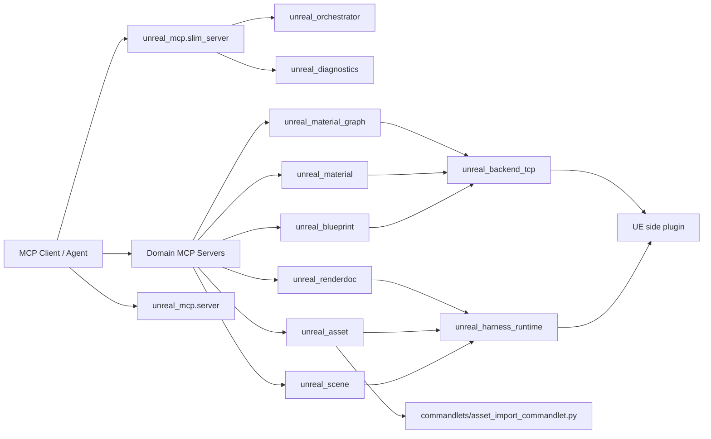

# Unreal MCP 功能文档

本文档基于当前仓库代码、`README.md`、`unreal_orchestrator/catalog.py`、各域 `server.py`、工具签名和测试契约整理。目标是说明这个 UE MCP 当前能做什么、应该从哪个入口使用、哪些能力仍属于内部 fallback。

## 1. 产品定位

`unreal-mcp` 是从 `TAAgent` 抽离出的独立 Unreal Editor MCP 仓库，用于让外部 agent 通过 MCP 操作 Unreal Editor、项目资产和 UE 侧调试流程。

核心能力：

- 连接正在运行的 Unreal Editor 插件 TCP 服务。
- 通过独立 domain MCP server 暴露场景、资产、蓝图、材质、材质图、诊断和 RenderDoc 功能。
- 通过瘦入口提供路由、发现、ready state 和 token 诊断，降低默认工具 schema 体积。
- 通过 UE 侧 C++ 插件执行部分高风险或图编辑命令。
- 通过 live editor Python / commandlet / C++ backend 混合完成业务操作。

## 2. 入口与运行方式

### 2.1 默认瘦入口

默认推荐入口：

```powershell
python -m unreal_mcp.slim_server
```

用途：

- 发现可用 domain。
- 路由自然语言任务到 domain。
- 检查 editor ready、transport、commandlet 和 token 使用情况。

暴露工具：

- `get_harness_domains`
- `get_domain_design`
- `route_harness_task`
- `get_runtime_policy`
- `get_editor_ready_state`
- `wait_for_editor_ready`
- `get_token_usage_summary`
- `get_transport_port_status`
- `get_commandlet_runtime_status`

### 2.2 独立 domain server

业务操作优先连接对应 domain server：

```powershell
python -m unreal_scene.server
python -m unreal_asset.server
python -m unreal_blueprint.server
python -m unreal_material.server
python -m unreal_material_graph.server
python -m unreal_renderdoc.server
python -m unreal_diagnostics.server
```

设计原则：

- 每个 domain 单独暴露自己的工具。
- 高风险 live-editor 工具由 `make_guarded_tool()` 包装，执行前可检查 editor ready。
- Orchestrator 不聚合业务工具，只负责路由和发现。

### 2.3 全量兼容入口

兼容入口：

```powershell
python -m unreal_mcp.server
```

用途：

- 一次性暴露所有 domain 工具。
- 当前默认约 78 个工具。
- 不建议作为默认 agent 配置，主要用于兼容和调试。

开发工具开关：

```powershell
$env:UNREAL_MCP_ENABLE_DEV_TOOLS="1"
```

启用后 full server 会包含 `dev_launch_editor_and_wait_ready`。

### 2.4 关键环境变量

```powershell
$env:UE_HOST="127.0.0.1"
$env:UE_PORT="55557"
$env:UE_PROJECT_PATH="D:\path\Project.uproject"
$env:UE_ENGINE_ROOT="D:\path\UE\Engine"
$env:UE_EDITOR_EXE="D:\path\UnrealEditor.exe"
$env:UE_EDITOR_CMD="D:\path\UnrealEditor-Cmd.exe"
```

说明：

- `UE_HOST` / `UE_PORT` 用于连接 UE 侧插件 TCP 服务。
- `UE_PROJECT_PATH` 用于 commandlet、RenderDoc context 和运行时路径解析。
- `UE_ENGINE_ROOT` / `UE_EDITOR_EXE` / `UE_EDITOR_CMD` 用于构建、commandlet 和诊断。

## 3. 总体架构



关键边界：

- `unreal_orchestrator`：只做路由和发现。
- `unreal_backend_tcp`：内部 TCP backend，负责 raw command、连接 UE 插件和大结果 handle。
- `unreal_harness_runtime`：编辑器 ready、live editor Python、commandlet、运行时路径解析。
- UE 侧插件：监听 TCP 并执行 UE 编辑器命令，按目标项目侧配置维护。

## 4. Domain 功能总览

| Domain | Server | 工具数 | 默认用途 | 主要后端 |
| --- | --- | ---: | --- | --- |
| `orchestrator` | `unreal_orchestrator.server` | 3 | 路由、发现、domain 设计元数据 | Python |
| `diagnostics` | `unreal_diagnostics.server` | 10 | ready、transport、runtime、token、进程诊断 | Python |
| `scene` | `unreal_scene.server` | 12 | Actor、灯光、后处理、批量场景操作 | live editor Python |
| `asset` | `unreal_asset.server` | 19 | 资产查询、CRUD、导入、贴图属性、Cascade 检查 | live editor Python / commandlet / TCP fallback |
| `blueprint` | `unreal_blueprint.server` | 10 | 蓝图内容读取、图分析、节点创建和连线 | C++ TCP backend |
| `material` | `unreal_material.server` | 10 | 材质资产、材质函数、材质实例和参数 | live editor Python / C++ TCP backend |
| `material_graph` | `unreal_material_graph.server` | 6 | 材质图读取、构建、patch、property connection | C++ TCP backend |
| `renderdoc` | `unreal_renderdoc.server` | 12 | RenderDoc 捕获、上下文 sidecar、符号反查、diff metadata | Python / UE context |

## 5. Orchestrator 与发现

入口：

```powershell
python -m unreal_orchestrator.server
```

工具：

| 工具 | 功能 |
| --- | --- |
| `get_harness_domains` | 返回全部 domain 的 backend、状态、server module、推荐连接方式。 |
| `get_domain_design` | 返回指定 domain 的设计元数据和启动参数。 |
| `route_harness_task` | 根据任务文本匹配最可能的 domain。 |

适用场景：

- agent 首次接入时确定应该启用哪个 domain。
- 避免默认加载全量工具。
- 查询 domain 的 server module 和 ready 要求。

## 6. Diagnostics 功能

入口：

```powershell
python -m unreal_diagnostics.server
```

工具：

| 工具 | 功能 |
| --- | --- |
| `get_harness_health` | 返回 harness 基础健康信息。 |
| `get_runtime_policy` | 说明普通使用和 MCP 开发调试的运行边界。 |
| `get_token_usage_summary` | 汇总已记录 token 使用。 |
| `get_transport_port_status` | 检查 UE MCP TCP 端口是否可连接。 |
| `get_unreal_python_status` | 检查当前编辑器是否可执行 Unreal Python。 |
| `get_editor_process_status` | 汇总本机 UnrealEditor 进程状态。 |
| `get_commandlet_runtime_status` | 检查 commandlet 所需路径和可执行文件。 |
| `get_editor_ready_state` | 汇总 transport、Python、项目、关卡等 ready state。 |
| `wait_for_editor_ready` | 轮询等待 editor ready。 |
| `dev_launch_editor_and_wait_ready` | 开发调试用：启动 editor 并等待 ready。 |

注意：

- 普通业务操作前不应隐式启动编辑器。
- `dev_launch_editor_and_wait_ready` 属于 internal/debug 流程。

## 7. Scene 功能

入口：

```powershell
python -m unreal_scene.server
```

工具：

| 工具 | 功能 |
| --- | --- |
| `get_scene_harness_info` | 返回 scene domain 能力和边界。 |
| `get_scene_backend_status` | 返回 scene backend 状态快照。 |
| `query_scene_actors` | 按 class、名称过滤和分页查询 Actor。 |
| `query_scene_lights` | 查询灯光 Actor 及关键强度字段。 |
| `set_scene_light_intensity` | 设置灯光强度、单位和可选 mobility，并做 readback。 |
| `set_actor_component_material` | 给 StaticMeshComponent 设置材质覆盖并回读验证。 |
| `create_spot_light_ring` | 围绕中心点创建一圈聚光灯并对准目标。 |
| `aim_actor_at` | 让 Actor 朝向世界坐标目标。 |
| `set_post_process_overrides` | 写入后处理覆盖项和 override flag，并回读验证。 |
| `spawn_actor_with_defaults` | 生成 Actor 并设置 actor/root component 默认属性。 |
| `apply_scene_actor_batch` | 批量生成或更新 Actor recipe。 |
| `delete_scene_actors_batch` | 批量删除 Actor，支持过滤、排除和保留数量。 |

适用场景：

- 场景布光。
- Actor 查询、摆放和批量编辑。
- 设置组件材质。
- 后处理体积参数修改。

边界：

- Scene 域只处理关卡、Actor、灯光、组件级场景操作。
- 资产创建、导入和材质图编辑不属于 scene。

## 8. Asset 功能

入口：

```powershell
python -m unreal_asset.server
```

工具：

| 工具 | 功能 |
| --- | --- |
| `get_asset_harness_info` | 返回 asset domain 能力和支持创建类型。 |
| `query_assets_summary` | 查询资产摘要，支持路径、class、名称、分页。 |
| `query_textures` | 查询 Texture2D，并内联读取指定 editor properties。 |
| `get_asset_properties` | 批量读取指定资产属性。 |
| `set_asset_properties` | 对多个资产写入同一属性 payload。 |
| `ensure_folder` | 确保 Content Browser 文件夹存在。 |
| `create_asset_with_properties` | 创建支持类型资产并设置初始属性。 |
| `ensure_asset_with_properties` | 资产存在则更新，不存在则创建。 |
| `duplicate_asset_with_overrides` | 复制资产并可选覆盖属性。 |
| `move_asset_batch` | 批量移动资产包路径。 |
| `update_asset_properties` | 更新单个资产属性。 |
| `update_asset_properties_batch` | 一次 UE Python 往返批量更新资产属性，内置 chunk。 |
| `set_texture_compression_settings` | 批量设置纹理压缩配置。 |
| `set_texture_srgb` | 批量设置纹理 sRGB。 |
| `update_texture_group_config` | 修改项目 device profile 中的 TextureLODGroups。 |
| `import_texture_asset` | 通过 commandlet 导入纹理。 |
| `import_fbx_asset` | 通过 commandlet 导入 FBX。 |
| `inspect_particle_system` | 检查 Cascade ParticleSystem；必要时 fallback 到 Niagara backend 摘要。 |
| `inspect_cascade_emitter` | 检查指定 Cascade emitter。 |

适用场景：

- 资产浏览和属性批量修改。
- 贴图压缩、sRGB、LOD group 调整。
- 通用资产创建、复制、移动。
- 纹理和 FBX 导入。
- Cascade 粒子系统检查。

边界：

- 创建和更新优先走 live editor Python。
- 导入优先走 commandlet。
- 大批量更新会分 chunk，返回 `summary`、`items`、`post_state`、`verification`。

## 9. Blueprint 功能

入口：

```powershell
python -m unreal_blueprint.server
```

工具：

| 工具 | 功能 |
| --- | --- |
| `get_blueprint_harness_info` | 返回 blueprint domain 能力和边界。 |
| `read_blueprint_content` | 读取蓝图组件、变量、函数、接口和 EventGraph 摘要。 |
| `analyze_blueprint_graph` | 分析指定蓝图图，支持节点、pin、连线和执行流摘要。 |
| `find_blueprint_nodes` | 按标题、class、节点名、pin 名和方向过滤节点。 |
| `get_blueprint_variable_details` | 读取变量元数据。 |
| `get_blueprint_function_details` | 读取函数元数据，可包含图。 |
| `add_blueprint_node` | 创建蓝图图节点。 |
| `connect_blueprint_nodes` | 连接两个蓝图节点 pin。 |
| `set_blueprint_node_property` | 设置节点属性或执行语义节点编辑动作。 |
| `add_point_light_component_node` | 创建 PointLightComponent 的便捷节点。 |

适用场景：

- 蓝图结构检查。
- 蓝图图节点定位。
- K2 节点创建、连线和属性编辑。
- 特定组件添加流程。

边界：

- 高层蓝图内容读取和 graph 编辑共用 `unreal_blueprint.server`。
- 复杂 graph 编辑依赖 UE 侧 C++ BlueprintGraph backend。

## 10. Material 功能

入口：

```powershell
python -m unreal_material.server
```

工具：

| 工具 | 功能 |
| --- | --- |
| `get_material_harness_info` | 返回 material domain 能力和边界。 |
| `create_material_asset` | 创建 Material 资产。 |
| `create_material_function_asset` | 创建 MaterialFunction 资产。 |
| `create_material_instance_asset` | 创建 MaterialInstanceConstant 并绑定父材质。 |
| `update_material_instance_properties` | 更新材质实例属性。 |
| `update_material_instance_parameters_and_verify` | 批量设置 scalar/vector/texture 参数并结构化验证。 |
| `get_material_instance_parameter_names` | 读取材质或材质实例暴露参数名。 |
| `set_material_instance_scalar_parameter` | 设置 scalar 参数。 |
| `set_material_instance_vector_parameter` | 设置 vector 参数。 |
| `set_material_instance_texture_parameter` | 设置 texture 参数。 |

适用场景：

- 新建材质、材质函数和材质实例。
- 设置 MI 参数。
- 批量参数更新和回读验证。

边界：

- 材质资产、实例、参数属于 `material`。
- 材质节点图创建、连线、属性连接属于 `material_graph`。

## 11. Material Graph 功能

入口：

```powershell
python -m unreal_material_graph.server
```

工具：

| 工具 | 功能 |
| --- | --- |
| `get_material_graph_harness_info` | 返回 material graph domain 能力和边界。 |
| `analyze_material_graph` | 读取并摘要材质或材质函数图。 |
| `create_material_graph_recipe` | 使用 recipe 构建或 patch 材质图。 |
| `connect_material_nodes` | 创建节点并连接节点/属性连接。 |
| `set_material_graph_property_connections` | 只 patch 材质根属性连接。 |
| `patch_material_graph` | 增删节点、断连、更新节点、属性和 property connection。 |

当前支持重点：

- `nodes`
- `connections`
- `properties`
- `property_connections`
- `update_nodes`
- `delete_nodes`
- `disconnect_connections`
- `disconnect_properties`
- 编译开关和图 readback。
- 大图摘要、分页 handle 和完整图读取。

适用场景：

- 材质图读取和诊断。
- 从 recipe 重建 UE 材质图。
- 增量 patch 材质图。
- 设置 `BaseColor`、`Roughness`、`Normal`、`PixelDepthOffset` 等根属性连接。

边界和要求：

- 图编辑后必须 readback，不能只信 `success: true`。
- 需要检查关键 `nodes`、`connections`、`property_connections`。
- 修改 MaterialFunction 后，需要刷新父材质或相关 FunctionCall。
- 优先使用 UE 原生 material node；`Custom` 只用于确实缺原生节点或源材料本身就是自定义逻辑。

## 12. RenderDoc 功能

入口：

```powershell
python -m unreal_renderdoc.server
```

工具：

| 工具 | 功能 |
| --- | --- |
| `get_renderdoc_harness_info` | 返回 RenderDoc domain 能力。 |
| `get_renderdoc_runtime_status` | 检查 RenderDoc 安装、capture 目录和最近捕获。 |
| `get_renderdoc_capture_context` | 收集 UE 捕获上下文、视口、关卡、RHI、CVar、选择对象等信息。 |
| `get_renderdoc_selection_context` | 获取当前选择对象并生成 RenderDoc 语义提示。 |
| `map_material_to_renderdoc_context` | 将材质/材质实例映射到 pass 和 shader context hints。 |
| `normalize_renderdoc_debug_labels` | 规范化 RenderDoc debug label。 |
| `reverse_lookup_renderdoc_symbols` | 根据 shader/parameter hints 在 shader debug、源码、C++ 中反查符号。 |
| `set_renderdoc_debug_workflow` | 应用 debug viewmode 或诊断 CVar。 |
| `request_renderdoc_capture` | 触发 RenderDoc capture，并在旁边保存 UE context JSON。 |
| `capture_current_selection` | 针对当前选择对象进行一次 capture。 |
| `capture_current_viewport_issue` | 捕获当前 viewport 问题，并保存截图。 |
| `capture_renderdoc_diff_pair` | 对 base/variant 配置各捕获一次，输出 diff metadata。 |

适用场景：

- 复现渲染问题时保存 UE 上下文 sidecar。
- 根据选中对象映射材质、pass、shader 和 CVar。
- 对比两个渲染配置下的 `.rdc` 捕获。

## 13. 内部 TCP Backend 与 UE 插件能力

`unreal_backend_tcp` 是内部 backend，不是默认业务入口。它负责：

- 连接 UE 插件 TCP 服务。
- 发送 raw command。
- 管理大结果 `result_handle`。
- 给部分 domain 工具提供 fallback。

公开 wrapper：

- `get_assets`
- `get_current_level`
- `build_material_graph`
- `create_material_function`
- `get_material_graph`
- `read_blueprint_content`
- `analyze_blueprint_graph`
- `get_blueprint_variable_details`
- `get_blueprint_function_details`
- `add_blueprint_node`
- `connect_nodes`
- `set_node_property`
- `read_result_handle`
- `release_result_handle`

UE 侧 C++ 插件当前 bridge 支持的 raw command 分组：

- Editor / asset：`get_actors_in_level`、`find_actors_by_name`、`set_actor_transform`、`spawn_blueprint_actor`、`import_fbx`、`create_asset`、`delete_asset`、`set_asset_properties`、`get_asset_properties`、`batch_create_assets`、`batch_set_assets_properties`、`run_python`
- Blueprint：`create_blueprint`、`add_component_to_blueprint`、`set_physics_properties`、`compile_blueprint`、`set_static_mesh_properties`、`set_mesh_material_color`、`read_blueprint_content`、`analyze_blueprint_graph`、`get_blueprint_variable_details`、`get_blueprint_function_details`、`get_assets`、`set_static_mesh_asset_properties`、`get_editor_widget_blueprint_info`、`update_editor_widget_blueprint`
- Material：`create_material`、`create_material_function`、`build_material_graph`、`get_material_graph`、`set_material_properties`、`create_material_instance`、`set_material_instance_parameter`、`import_texture`
- Environment：`get_viewport_screenshot`、`set_viewport_camera`、`get_viewport_camera`、`create_level`、`load_level`、`save_current_level`、`get_current_level`、`spawn_actor`、`delete_actor`、`get_actors`、`batch_spawn_actors`、`batch_delete_actors`、`batch_set_actors_properties`、`set_actor_properties`、`get_actor_properties`
- Blueprint Graph：`add_blueprint_node`、`connect_nodes`、`create_variable`、`set_blueprint_variable_properties`、`add_event_node`、`delete_node`、`set_node_property`、`create_function`、`add_function_input`、`add_function_output`、`delete_function`、`rename_function`
- Niagara：`get_niagara_graph`、`update_niagara_graph`、`get_niagara_emitter`、`update_niagara_emitter`、`get_niagara_compiled_code`、`get_niagara_particle_attributes`

使用原则：

- 优先使用 domain server 的高层工具。
- 只有高层工具缺能力或调试时才直接使用 backend/raw command。
- 如果同类 fallback 重复出现，应按 tool gap 流程登记。

## 14. 典型工作流

### 14.1 选择 domain

```powershell
python -m unreal_mcp.slim_server
```

1. 调 `route_harness_task` 判断任务属于哪个 domain。
2. 调 `get_domain_design` 获取 `server_module`。
3. 启动对应 domain server。
4. 高风险 live-editor 操作前调 `get_editor_ready_state` 或 `wait_for_editor_ready`。

### 14.2 场景布光

推荐 domain：`scene`

流程：

1. `query_scene_lights` 查看现有灯光。
2. `create_spot_light_ring` 创建灯光阵列，或 `set_scene_light_intensity` 调整已有灯。
3. `aim_actor_at` 校正朝向。
4. 回读 `query_scene_lights` 或目标 Actor transform。

### 14.3 资产导入和属性修正

推荐 domain：`asset`

流程：

1. `import_texture_asset` 或 `import_fbx_asset` 导入外部文件。
2. `query_assets_summary` / `query_textures` 确认资产存在。
3. `set_texture_compression_settings`、`set_texture_srgb` 或 `update_asset_properties_batch` 批量设置属性。
4. 检查 `verification` 和 `failed_changes`。

### 14.4 材质实例参数更新

推荐 domain：`material`

流程：

1. `create_material_instance_asset` 创建 MI。
2. `get_material_instance_parameter_names` 确认参数名。
3. `update_material_instance_parameters_and_verify` 批量设置 scalar/vector/texture。
4. 检查结构化验证结果。

### 14.5 材质图 patch

推荐 domain：`material_graph`

流程：

1. `analyze_material_graph` 读取当前图。
2. `patch_material_graph` 增删节点、断连、更新节点或 property connection。
3. 再次 `analyze_material_graph(include_full_graph=True)` 回读。
4. 检查 `nodes`、`connections`、`property_connections` 和编译结果。

### 14.6 RenderDoc 捕获

推荐 domain：`renderdoc`

流程：

1. `get_renderdoc_runtime_status` 检查运行条件。
2. `get_renderdoc_capture_context` 生成 UE 侧上下文。
3. `request_renderdoc_capture` 捕获 `.rdc` 并保存 `.context.json`。
4. 必要时用 `reverse_lookup_renderdoc_symbols` 做符号反查。

## 15. 返回结构与验证模型

高层工具倾向返回结构化结果：

```json
{
  "success": true,
  "operation_id": "domain:action:timestamp",
  "domain": "asset",
  "targets": [],
  "applied_changes": [],
  "failed_changes": [],
  "post_state": {},
  "verification": {
    "verified": true,
    "checks": []
  }
}
```

字段含义：

- `success`：工具层是否完成。
- `operation_id`：可追踪操作 ID。
- `targets`：被操作对象。
- `applied_changes`：实际应用的变更。
- `failed_changes`：失败字段或对象。
- `post_state`：操作后回读状态。
- `verification`：结构化校验结果。

大结果处理：

- 默认返回摘要，避免大图和大蓝图内容占用过多 token。
- 可用 `result_handle` 存储完整结果。
- 用 `read_result_handle(path, offset, limit, fields)` 分页读取。
- 用 `release_result_handle` 释放。

## 16. 当前限制和注意事项

- `unreal_orchestrator` 不执行业务操作，只负责路由和发现。
- `unreal_backend_tcp` 是内部 backend / fallback，不是默认业务入口。
- `material` 和 `material_graph` 必须区分：材质资产/实例/参数走 `material`，节点图走 `material_graph`。
- `niagara` 仍是 planned split，没有独立 domain server；需要时走 legacy/internal fallback。
- UE 侧插件改动后，已打开的 Unreal Editor 通常需要重启才会加载新 DLL。
- 普通工具调用不应隐式启动或重启编辑器。
- 材质图和蓝图图编辑依赖 UE 侧实际状态，文档不能替代 live 回归。

## 17. 相关文件

- `README.md`：仓库入口说明。
- `docs/agent-quickstart.md`：agent 默认入口、domain 选择和 token 禁忌。
- `docs/material-graph-ir.md`：材质图 IR 方案。
- `.claude/skills/ue-harness/references/inventory.md`：历史功能清单和状态矩阵。
- `unreal_orchestrator/catalog.py`：domain 元数据和路由关键字。
- `config/mcp_config.example.json`：默认 MCP 客户端配置。
- `config/mcp_config.slim-domains.example.json`：瘦入口 + domain server 配置示例。
